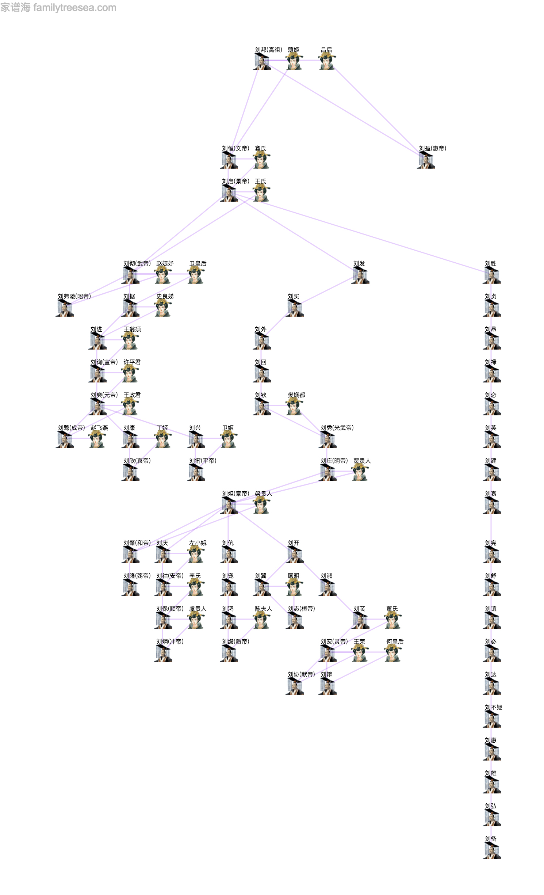
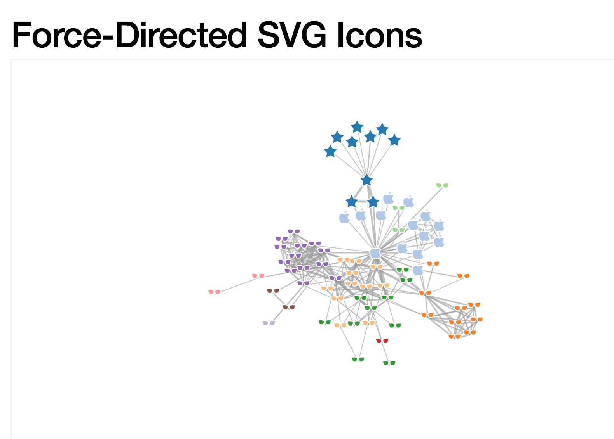

本代码只包含local private版，数据库使用无需安装的sqlite,网站版有更多完整的功能

家谱的数据结构并不复杂，逻辑上可以抽象成一种图，节点为人物，边为人物关系，关系粗略分为两类，一类是夸层级的亲子关系（如父子，父女，母子，母女），另一类为同层级的夫妻关系（其实如果要加上更多的也可以）。有了这两类关系，就可以完全地描述一个家谱人物关系。那么在数据库中表示只需要两张表就够了，一个person表，一个relation表
person表的形式可以为(id, name, sex ...), relation表的形式可以为(id, from_person_id, to_person_id, relation_name)

这种存储方式可以很方便地查询到一个完整地家谱，当然也有关系型数据库固有的缺点，就是不好做单人的连续的层级遍历，例如找一个人祖上十八代，那一定是对应大量的table join, 不过我这里不考虑这个问题，只专注于如何表征一个完整的家谱，并能自动排版在前端展示，最终要达到的一个效果如图

这张图在数据库层面就是按照如上描述存储的，然而前端要绘制成这样的树形结构则需要花一点点小功夫。

我这里使用d3的force directed graph进行绘制。d3的example图是这样的：

看起来是不是乱得一塌糊涂？如果你只按照上面的表关系建立好数据，然后直接用d3画图，结果也必然是这个样子。那如何把它变成看起来比较干净整洁的类似树形图呢？d3是没办法按照我们的要求自动排版的，原因很简单，我们的要求有三个，第一要分层级（父母在上子女在下），第二，线条交叉要尽量少，不要太杂乱无章，第三，树看起来比较平衡（例如不要很右边的父节点连到图最左边的子节点，难看的很），很显然，这种要求属于高度定制的要求，d3是不可能自动给你排的，那怎么做呢？我的思路是通过某种算法，确定图中每一个人物的坐标(x,y)，使得满足上面的3个要求，则自然结果图能够整洁。是不是废话？待我细细说来。。。

第一步，计算层级。

思路如下，先定一个记录标准：最上层为1层，其子所在层为2，再往下一层为3，以此类推。那么在给定一个图之后，只要这个图是连通图，那么从一个节点沿着关系一定能走到任意其他节点，基于这个前提，我用一种想象中的染色法，想象图中所有节点一开始都是白色，然后选定任意一个节点开始，随意标记一个层级，例如10，染成红色，然后从该红色节点出发，沿着其所有关系递归遍历其他节点，遍历时，如果是向上走，则走到的节点层级减1，向下走，则走到的节点层级加1，同层走，则走到的节点层级相同，直到所有节点都变成红色。这样递归完成后，所有的层级都定下来了，但是由于初始节点的层级是随便取的，最终得到的结果可能是10，11，12，13。。这样的层次，只要再做个“归一”，即把最小的层级变成1（例如如果层级列表为(10,11,12)，那么只要统一减去9，即可"归一"为（1，2，3））。

第二部：减少线条交织，自动调整层高

第一步做完以后，所有的节点都被分到了对应的层级，但仅仅这样画出来的图一定还是不好看，例如一对夫妻在同层级，但是如果一个放在图最左，一个放在图最右，中间还放了很多其他兄弟节点，那么这就很难看，亦或是A放在B的左边，然后A的后代确放在B的后代的右边，那么可想而知这里又会有很多不必要的线条交织，影响美观，所以要做到几件事，包括：1、把夫妻要并在一起放置，如果A和B是夫妻，C和D是夫妻，那么应该是ABCD这样的排布ok,但如果是ACDB这样就不行。2、如果甲和乙是亲兄弟，甲在乙的左边，那么甲的后代必须也在乙的左边，递归传下去。3，每层的层间距也不应固定，例如古代皇帝，有些有一百多个儿子，有些就一两个儿子，那么稍微想象，也能知道，画前者的层间距应该大于后者的层间距才好看，否则儿女多的人发散出去的线条会画得非常扁平。

第三步，树的平衡

这一步是基于前两步来做的，最终能够确定每个节点的列位置，如果说第一步确定了层位置，第二步粗粒度确定了列位置（排好了层级内每个节点的位序），那么这一步则是细粒度最终确定了列位置。根据实测，最终定了3个原则来唯一确定一个节点的列位置，第一，位序靠后的节点列坐标一定要大于位序靠前的列左边，例如某层内根据第二步确定好的位序为(A,B,C,D,E)则，B的列坐标一定大于A的列坐标，C的一定大于B的，以此类推。第二，一个节点的后代叶子节点数越多，它占领的该层的列空间就要越大，同时与下层的距离也要越大，每层和下一层的最终距离为该层所有节点的这种距离中的最大者。第三，一个节点的位置还受到其父节点的影响，父节点若有n个后代叶子节点，则本节点的列坐标不应该小于父节点的列坐标-n/2。根据这三个原则，就能确定唯一的节点位置。

具体的算法代码用到了大量的记账式递归(recursion+memoization)，例如计算层级，计算某节点的后代叶子节点数，拆开来看都不算复杂，拼在一起会有点绕

所得结果的演示，已有网站成品：http://www.familytreesea.com/public-tree-detail/11

欢迎大家体验和使用
